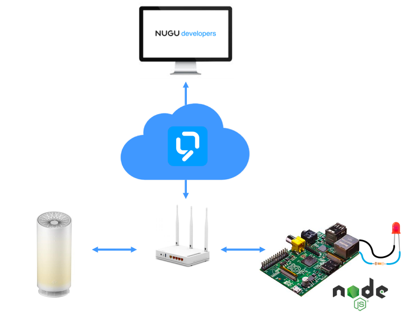
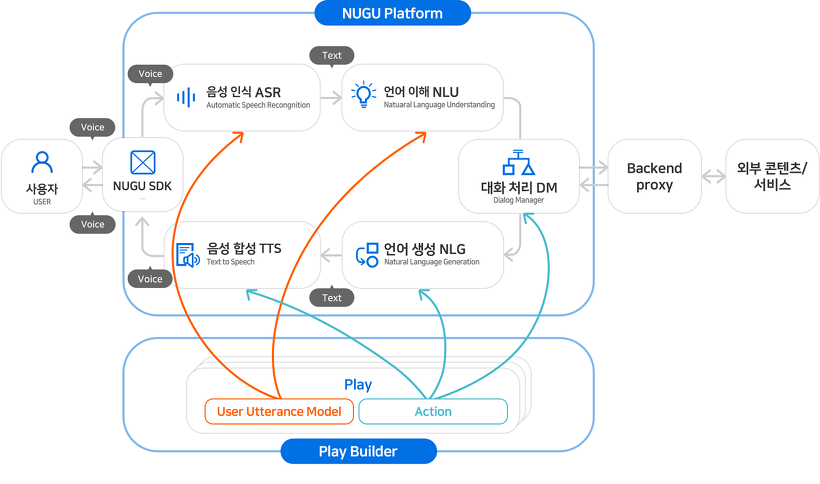
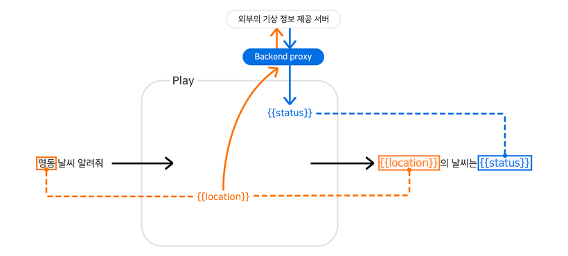

# NUGU로 라즈베리파이 제어해보자!   

NUGU는 SK 텔레콤의 인공지능 기술로서, 
사용자의 자연어(음성 언어 또는 문자 언어) 요청을 이해하여 의도를 파악한 후 
특정 명령을 수행하거나 자연어로 응답하는 대화 기반 인공지능 플랫폼입니다.

주요기능
---
- 최근 인공지능 서비스를 개발 할 수 있는 NUGU developers가 오픈되었습니다.
NUGU developers는 대화 기반 인공지능 서비스를 개발할 수 있는 통합 개발 환경을 GUI 기반으로 제공함으로써, 사용자들은 NUGU developers를 통해 좀더 쉽게 자신들의 서비스를 개발할 수 있습니다.

   - [Nugu Developers 가이드문서](https://developers.nugu.co.kr/docs/)

NUGU로 라즈베리파이 컨트롤하기
--
- NUGU developers에서는 사용자 발화가 처리되는 과정에 반드시 필요한 요소 기술들을 제공하고,서비스를 개발할 수 있는 통합 개발 환경인 Play Builder를 제공합니다. 본 Task에선 NUGU developers에서 제공하는 기능 중 Backend proxy를 응용하여 NUGU스피커로 라즈베리파이의 GPIO를 제어하는 과정을 소개하고자 합니다.
  
  

- 본 과정을 수행하기 위해서는 다음과 같은 사전학습이 필요합니다.
   - 라즈베리파이의 GPIO제어 
   - 라즈베리파이에 웹 서버 구축 및 구동
   
- 본 과정을 수행하기 위해서는 다음과 같은 준비물이 필요합니다.
   - 고정 IP를 설정할 수 있는 공유기
   - NUGU 스피커 
   - 라즈베리파이3와 LED 회로구성
   - Nugu Developers 를 접속 할 수 있는 컴퓨터 
   
   
   
   
  
서비스 저작도구, NUGU Play Kit이란?
--
- NUGU Play Kit은 NUGU의 서비스 단위인 Play를 제작하는 도구입니다.개발자가 아니어도 대화 기반 서비스를 개발할 수 있는 통합 환경을 제공하여,자신이 직접만든 서비스를 NUGU 사용자에게 제공할 수 있도록 도와줍니다.

- 라즈베리파이 제어에 필요한 NUGU Play Kit 기능은 다음과 같이 구성됩니다.
   - Play를 제작하는 Play Builder
   - 응답 생성에 필요한 정보를 외부 서버로부터 가져오기 위한 Backend proxy API
   
- NUGU Play Kit을 활용하여 Play를 제작하는 과정은 다음과 같습니다.
   - Play Builder를 이용하여 Play를 만듭니다.
   - 제작한 Play를 배포하기 위한 심사를 요청합니다.
   - 심사가 완료되면 배포를 통해 NUGU 사용자에게 서비스가 제공됩니다.
   
   
   
   
   
Backend Proxy 연동
--
- 외부 서버를 호출하여 대화 관리자에게 정보를 전달하는 서버를 Backend proxy라고 합니다. Backend proxy는 외부 서버로부터 가져온 정보를 수정하거나 복잡한 로직을 통해 조건을 판단하는 기능도 수행할 수 있는데, 개발자가 직접 개발하여 NUGU 플랫폼과 연동할 수 있도록 준비해야 합니다.

